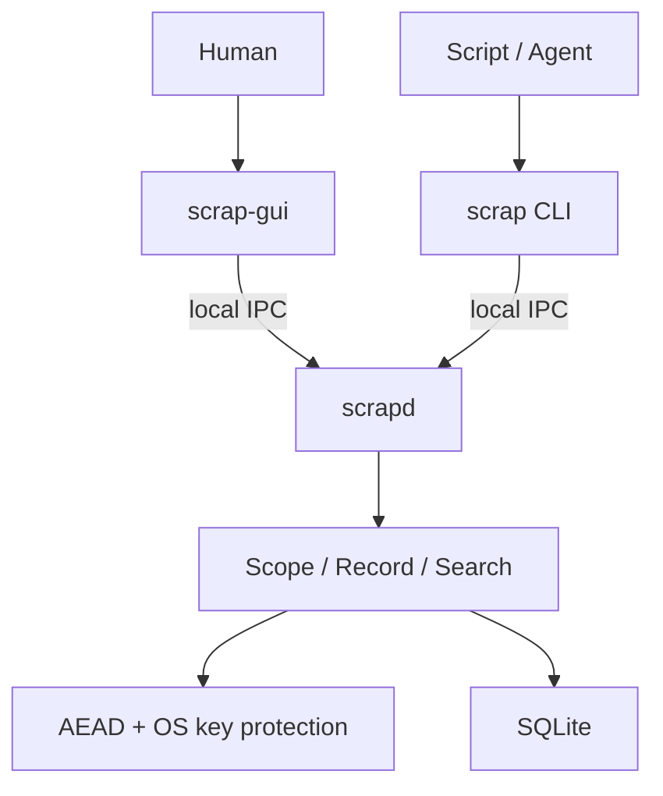

# scrap 系统设计

> 一个 local-first、scriptable 的本地秘密与字段存储：CLI 面向程序组合，GUI 面向人类发现，`scrapd` 是唯一数据权威。

## 1. 产品定义

`scrap` 用来保存密码、令牌、账户标识、部署 ID、服务端点等本地开发过程中需要反复取用的短文本值。

它不是通用数据库，也不是完整密码管理器。它只提供两个领域概念：

```text
Scope
  └── Record*
        ├── Key
        └── Value
```

- `scope` 是记录的命名空间与组织边界。
- `record` 是一个 `(key, value)` 对，也是最小读写单位。
- `(scope, key)` 构成记录的唯一身份。
- `value` 是 UTF-8 文本，不引入额外类型系统。
- 所有 value 均加密；是否遮罩只是一项呈现策略，不是加密策略。

一句话边界：

> `scrap` 是由一个本地 daemon 和两个 client 构成的 scoped credential KV，而不是文档数据库、配置中心或远程 vault。

## 2. 设计原则

### 2.1 单一数据权威

只有 `scrapd` 可以访问数据库、主密钥和加解密实现。CLI 与 GUI 都是协议客户端（protocol client），不链接存储实现，也不直接打开数据库。

### 2.2 两套交互语义

- CLI 为确定性、管道组合和机器消费优化。
- GUI 为搜索、浏览、选择、复制和编辑优化。
- 两者共享同一 IPC 契约与 daemon 领域语义，但不强求相同的交互形式。

### 2.3 小而封闭

系统只解决本地记录的安全保存与快速取用。任何需要层级对象、文档路径、schema、远程同步或权限协作的需求，都不进入核心模型。

### 2.4 默认信任本地登录用户

安全边界是当前操作系统账户。系统保护静态数据不因数据库文件泄露而直接暴露，同时减少终端回滚、日志和剪贴板造成的意外泄露；它不声称能够抵御已在同一用户权限下执行的恶意程序。

### 2.5 机制与策略分离

- daemon 定义数据身份、匹配、事务、加密和协议行为。
- CLI 决定 stdout、stderr 与退出码。
- GUI 决定视觉层级、焦点、遮罩、选择和剪贴板交互。
- 安装器决定二进制部署与 PATH 配置。

## 3. 非目标

`scrap` 明确不提供：

- 账户、文件夹、层级 scope 或 credential 对象模型；
- JSON 文档路径、schema、secondary index、join 或脚本事务；
- Web UI、HTTP API、远程访问或多用户共享；
- 云同步、浏览器自动填充、密码生成器或 TOTP；
- secret value 全文搜索；
- 常驻系统服务、Windows Service、systemd unit 或 launchd agent；
- GUI 调用 CLI 子进程，或 client 直接访问 SQLite；
- 把 secret 作为普通命令行参数传递；
- 自动向子进程注入所有秘密的 `run`/`exec` 包装器。

如果这些能力以后成为真实需求，应作为独立产品边界重新建模，而不是把它们逐项塞进 `scrap`。

## 4. 系统拓扑



硬不变量：

```text
GUI ──┐
      ├── IPC ──> scrapd ──> encrypted SQLite
CLI ──┘
```

以下路径均非法：

```text
GUI ──> CLI subprocess ──> database
GUI ────────────────────> database
CLI ────────────────────> database
client ──> localhost HTTP server
```

## 5. 领域模型

### 5.1 Scope

`Scope` 只包含一个用户可见名称。名称是扁平的，不使用 `/`、`.` 等字符暗示系统层级；这些字符只作为普通字符存在。

约束：

- 非空；
- 使用 Unicode 字符串；
- identity 比较采用 ordinal、大小写敏感语义；
- 前后空白不做隐式裁剪；由创建请求显式提交什么，就保存什么；
- 名称长度设定固定上限，协议层与数据库层使用同一约束。

### 5.2 Record

逻辑模型：

```text
Record = (scope, key, value, presentation, timestamps)
```

其中：

| 字段 | 语义 |
|---|---|
| `scope` | 所属命名空间 |
| `key` | scope 内的记录名称 |
| `value` | UTF-8 文本；持久化前加密 |
| `presentation` | `masked` 或 `plain`，只控制展示 |
| `created_at` | 创建时间 |
| `updated_at` | 最近修改时间 |

约束：

- `(scope, key)` 使用 ordinal、大小写敏感比较并保持唯一；
- `API_TOKEN` 与 `api_token` 可以同时存在；
- CLI 的 `get/set/delete` 对 key 始终进行大小写敏感精确寻址；
- `value` 不参与搜索、不进入日志、不出现在错误消息中；
- record 更新是整值替换，不支持局部 patch。

`presentation` 不是 value 类型：

```text
masked -> GUI 默认遮罩，复制后尝试定时清除剪贴板
plain  -> GUI 可以直接显示
```

两类 value 在数据库中采用完全相同的加密流程。

## 6. 搜索语义

### 6.1 请求模型

GUI 中一次 record 搜索表达为：

```text
SearchRequest
├── scopes: [] | [scope, ...]
├── query
├── mode: exact | fuzzy | regex
├── case_sensitivity: insensitive | sensitive
└── limit
```

`case_sensitivity` 是匹配修饰符，不与三种模式做笛卡尔积枚举。

一次搜索覆盖全部 scope，或一个明确的非空 scope 集合：

```text
scope filter -> (scope, key) candidates -> human selection -> reveal/copy/edit
```

协议中 `scopes: []` 是“全部 scope”的唯一表示；非空数组表示明确并集，并在领域边界按 ordinal 去重和排序。不引入 `null`、空选择与通配符三套特例。搜索只匹配 key；结果始终返回 scope 和 key，因此跨 scope 的同名 key 不会丢失身份。`limit` 是整个 scope 集合的全局上限，不是每个 scope 各自的上限。

### 6.2 Exact

- `sensitive`：ordinal 完全相等。
- `insensitive`：使用稳定、culture-invariant 的大小写折叠后完全相等。
- 大小写不敏感查询可能返回多个候选；GUI 由用户选择，不偷偷挑选一个。

### 6.3 Fuzzy

模糊搜索（fuzzy search）是候选生成与排序，不是记录寻址。其结果不承诺唯一，也不把分数解释为概率。

评分依次考虑：

1. 完全匹配；
2. 前缀匹配；
3. token/单词边界匹配；
4. 连续子串匹配；
5. 子序列匹配；
6. 编辑相似度；
7. 长度惩罚。

相同分数先使用 scope，再使用 key 的 ordinal 顺序稳定排序。GUI 只展示排序，不展示伪精确的百分比。

数据规模按数万条以内设计：daemon 从目标 scope 集合读取 `(scope, key)` 元数据后在内存中评分，无需引入搜索服务或向 value 建立 FTS 索引。

### 6.4 Regex

- 使用 .NET 正则表达式（regular expression）语义；
- 动态表达式必须设置执行超时；
- 能使用 non-backtracking 引擎时优先使用；
- 编译错误作为结构化查询错误返回，不导致 daemon 或 GUI 崩溃；
- regex 只匹配 key，绝不匹配 value。

### 6.5 搜索执行位置

所有匹配与排序都由 daemon 执行。GUI 只提交意图并展示候选，保证未来 CLI `find` 与 GUI 使用相同语义。

## 7. CLI 设计

CLI 可执行文件名为 `scrap`。它是一等 client，而不是 daemon 的管理壳。

### 7.1 命令面

```bash
scrap scope list
scrap scope create <scope>
scrap scope rename <old> <new>
scrap scope delete <scope>

scrap set <scope> <key>
scrap get <scope> <key>
scrap delete <scope> <key>
scrap list <scope>

scrap find <query> --exact [--scope <scope>]...
scrap find <query> --fuzzy [--scope <scope>]...
scrap find <pattern> --regex --all
scrap find <query> --fuzzy --scope cloud --scope staging --case-sensitive

scrap daemon ping
scrap daemon version
scrap daemon shutdown
```

`find` 未给出 `--scope` 时检索全部 scope；重复 `--scope` 表示明确并集。`--all` 是便于阅读和自描述脚本的显式写法，不得与 `--scope` 同时使用。未知的显式 scope 是错误，不会被静默忽略。文本结果为无歧义的 `scope<TAB>key` 行；JSON 包含 scope、key、presentation 和稳定元数据，但不包含 value 或伪概率分数。

具体命令名一旦发布即视为 userspace contract；内部架构可以激进演化，既有参数、输出和退出码不得随意破坏。

### 7.2 写入 value

TTY 中执行：

```bash
scrap set cloudflare api_token
```

CLI 使用无回显输入读取 value，不把 secret 放进命令历史。

管道中执行：

```bash
printf %s "$TOKEN" | scrap set cloudflare api_token
```

管道输入按 UTF-8 读取。默认只移除一个末尾行结束符（LF 或 CRLF），不做其他 trim；`--raw-stdin` 保留全部输入，以免含换行的值无法往返。

禁止将以下形式作为主接口：

```bash
scrap set cloudflare api_token "secret-on-command-line"
```

因为命令参数可能进入 shell history、进程列表、审计日志或 Agent transcript。

### 7.3 读取 value

```bash
scrap get cloudflare api_token
```

成功时 stdout 只包含原始 value，不添加标签、颜色或说明：

```text
stdout    = data
stderr    = diagnostics
exit code = result class
```

因此下列组合是稳定接口：

```bash
scrap get cloudflare api_token | wrangler secret put API_TOKEN
export CF_TOKEN="$(scrap get cloudflare api_token)"
```

向终端输出 secret 是调用者显式执行 `get` 的结果。CLI 不擅自改为剪贴板，也不因 stdout 连接 TTY 就改变数据语义。人类需要剪贴板时使用 GUI，或显式使用 `--clipboard`。

### 7.4 结构化输出

- `get` 默认输出 value 本身；
- `list`、`find` 和 `scope list` 支持 `--json`；
- JSON schema 属于版本化协议，字段只追加、不静默改名；
- 普通模式可为 TTY 着色，但检测到重定向时关闭颜色；
- `--no-color` 始终有效。

### 7.5 退出码

| Code | 含义 |
|---:|---|
| `0` | 成功 |
| `2` | 参数或用法错误 |
| `3` | scope 或 record 不存在 |
| `4` | 唯一性冲突或并发条件不满足 |
| `5` | daemon 启动、IPC 或协议错误 |
| `6` | store、密钥或解密不可用 |
| `7` | 输入校验或查询表达式错误 |

错误详情写入 stderr；错误信息不得包含 value、密钥材料或完整 IPC payload。

## 8. GUI 设计

GUI 使用 C# 与 Avalonia，实现为真正的本地桌面 client。视觉使用 `moesegfault-style` 的色彩、字体、间距、圆角、焦点和动效规则；样式系统是独立 presentation concern，不渗入领域或协议层。

### 8.1 主交互

```text
Scope manager + search coverage (current / all)
    ↓
Search input
    ↓
Exact / Fuzzy / Regex + Aa
    ↓
Ranked key candidates
    ↓
Selected record
    ↓
Copy / Reveal / Edit / Delete
```

核心布局：

- 顶部：scope 选择、scope 管理与搜索覆盖范围；
- 中部：搜索框、匹配模式、大小写开关；
- 左侧或主列表：key 候选；
- 详情区：选中记录的 key、遮罩 value 和操作；
- 编辑采用明确的保存/取消，不因失焦静默提交。

### 8.2 行为规则

- 启动后焦点进入搜索框；
- fuzzy 是默认模式；
- 输入时 debounce，并取消已过时的请求；
- 搜索结果必须可用键盘完整操作；
- `Enter` 选择候选；
- `Ctrl+K` 或 `/` 聚焦搜索；
- `Ctrl+C` 复制当前记录 value；
- `Ctrl+N` 新建 record；
- 检索覆盖范围可在当前 scope 与全部 scope 之间选择，默认为全部；所有候选都显示 scope 与 key；
- masked value 默认不显示；
- reveal 是明确、短暂、可逆的 UI 状态；
- copy 成功只给轻量反馈，不弹阻塞式对话框；
- 删除需要展示准确的 `scope/key`，避免删错同名候选；
- fuzzy 分数不显示为百分比。

新建/编辑 record 中不展示两个并列且似乎相互影响的“masked”和“隐藏”选项，而是两个正交状态：

| 状态 | 生命周期 | 语义 |
|---|---|---|
| 编辑时可见性 | 仅当前对话框 | value 输入框现在是否显示文本；眼睛按钮只切换此状态 |
| 默认展示策略 | 保存到 record | 详情页默认是遮罩（Masked）还是直接显示（Visible） |

新建 record 默认是“编辑时隐藏 + 详情默认遮罩”。点击眼睛不能偷偷改变保存策略，切换 Masked/Visible 也不能改变当前输入框可见性。两种策略的 value 都使用同一加密流程。详细状态机与文案见 [`ux-product-spec.md`](ux-product-spec.md)。

### 8.3 剪贴板

复制 masked value 后，GUI 在短时间后尝试清除剪贴板，但只在剪贴板内容仍等于本次复制内容时清除，避免覆盖用户随后复制的新内容。

剪贴板并非安全存储。自动清除是降低暴露窗口的 best-effort 策略，不能承诺抵御剪贴板管理器、截图软件或同权限恶意程序。

### 8.4 错误与空状态

- 无 scope：引导创建第一个 scope；
- scope 为空：允许直接创建 record；
- 无匹配：保留查询并明确显示“无候选”；
- regex 非法：在搜索框附近显示表达式错误；
- daemon 不可用：client 尝试启动，失败后显示可操作的诊断；
- key provider 不可用：禁止进入假装成功但实际明文降级的状态。

### 8.5 主题与国际化

GUI 使用 MoeSegFault Style `v0.1.2` 的语义设计标记（semantic design tokens），通过 Avalonia `ThemeDictionaries` 映射到原生控件；视图不得散落原始颜色。它们之间的可追溯映射、对比度修正与上游来源记录在 [`research-platform-style.md`](research-platform-style.md)。

- 主题是 `System | Light | Dark`，首次使用 `System`；保存用户选择而不是仅保存当前解析结果。
- 界面语言为简体中文与英文；首次根据 OS UI culture 选择，不匹配时回退英文。
- 主题和语言是互相独立的非敏感偏好，保存在 `LocalAppData/MoeSegFault/Scrap/preferences.json`；持久化失败时界面仍保持可用。切换语言即时刷新已打开界面，不需重启。
- 用户数据、路径、CLI 机器 token 和 daemon 原始诊断不作为可翻译内容；界面包装与已知错误码才本地化。
- 页面采用动态资源，在浅色、深色及键盘焦点下保持可读性，并尊重减少动效偏好。

### 8.6 产品图标

Scrap 使用独立于 MoeSegFault 品牌字标的产品图标。当前 master raster 是 `assets/branding/scrap-icon-source.png`，标准尺寸导出位于 `assets/branding/`，GUI ICO/PNG 位于 `src/Scrap.Gui/Assets/`，website 只保留其静态页面所需的导出。同一视觉身份用于 Avalonia window 与 executable、Windows MSI/ARP/开始菜单和发布页。派生资产不得各自手工重绘；更换 master 时必须一次性重新导出并在 16、32 和 256 px 检查。可编辑矢量源尚未入库，是后续品牌资产维护缺口。

## 9. IPC 协议

### 9.1 Transport

不使用 HTTP、REST 或 gRPC。IPC 使用 .NET Named Pipe API：

- Windows 使用 named pipe，并将访问控制限制为当前用户 SID；
- Unix-like 平台由 .NET 映射到 Unix domain socket，socket 位于 `~/.scrap/run/`，目录权限为 `0700`，socket 不允许其他用户访问。

IPC endpoint 包含当前用户身份或 profile 标识，避免多用户会话误连。

### 9.2 Framing

每条消息使用：

```text
uint32 little-endian payload_length
UTF-8 JSON payload
```

daemon 在分配 payload buffer 前校验固定最大消息尺寸。超长消息直接拒绝并关闭该连接，避免无界内存分配。

### 9.3 Envelope

请求：

```json
{
  "protocolVersion": 1,
  "requestId": "01J...",
  "method": "record.get",
  "params": {
    "scope": "cloudflare",
    "key": "api_token"
  }
}
```

成功响应：

```json
{
  "protocolVersion": 1,
  "requestId": "01J...",
  "result": {
    "value": "..."
  }
}
```

失败响应：

```json
{
  "protocolVersion": 1,
  "requestId": "01J...",
  "error": {
    "code": "record_not_found",
    "message": "Record does not exist."
  }
}
```

协议约束：

- `requestId` 原样回传；
- 一个响应只能有 `result` 或 `error`；
- 未识别 method 返回结构化错误；
- 客户端先通过 `daemon.version` 协商协议版本；
- value 只出现在必要的 request/response 内存中，不记录 payload；
- 新增字段遵循向后兼容原则，删除或改义必须提升主协议版本。

### 9.4 方法集合

```text
scope.list
scope.create
scope.rename
scope.delete

record.get
record.set
record.delete
record.list
record.search

daemon.ping
daemon.version
daemon.shutdown
```

搜索不是 client 私有实现；`record.search` 接收完整 `SearchRequest`。

## 10. Daemon 生命周期与并发

### 10.1 按需启动

`scrapd` 不是系统服务。CLI 或 GUI 的 bootstrap 流程为：

```text
connect
  ├── success -> send request
  └── failure -> spawn scrapd -> wait for ready -> reconnect
```

多个 client 同时启动时可能并发 spawn。daemon 必须通过单实例锁保证每个用户/profile 只有一个 owner；失败者退出，client 继续重试连接。这是正常竞争，不是错误弹窗。

GUI 打开期间保持连接。daemon 在没有 client 且超过固定 idle window 后退出；是否调整 idle window 属于运行策略，不改变协议与领域模型。

### 10.2 请求处理

- 多个 client 可以并发连接；
- mutation 使用短事务并在 daemon 内串行提交；
- read/search 可以并发，但不得观察到半完成 mutation；
- scope rename/delete 与 record mutation 由数据库事务保证原子性；
- GUI 取消搜索只取消无副作用查询，不取消已经提交的 mutation；
- daemon 关闭时先停止接收新请求，再完成或明确拒绝在途 mutation。

## 11. 存储设计

SQLite 是唯一持久化数据库。它只由 daemon 打开，因此不存在 client 间数据库锁协议。

### 11.1 Schema

```sql
CREATE TABLE meta (
    key   TEXT PRIMARY KEY,
    value TEXT NOT NULL
);

CREATE TABLE scopes (
    id         INTEGER PRIMARY KEY,
    name       TEXT NOT NULL COLLATE BINARY UNIQUE,
    created_at TEXT NOT NULL,
    updated_at TEXT NOT NULL
);

CREATE TABLE records (
    id               TEXT PRIMARY KEY,
    scope_id         INTEGER NOT NULL REFERENCES scopes(id) ON DELETE CASCADE,
    key              TEXT NOT NULL COLLATE BINARY,
    value_ciphertext BLOB NOT NULL,
    nonce            BLOB NOT NULL,
    presentation     INTEGER NOT NULL,
    created_at       TEXT NOT NULL,
    updated_at       TEXT NOT NULL,
    UNIQUE(scope_id, key)
);

CREATE INDEX records_by_scope ON records(scope_id);
```

说明：

- `records.id` 是不可变随机标识，用于加密关联数据，不暴露为用户概念；
- scope 和 key 必须明文保存，才能支持 GUI 检索；
- value 在进入 SQLite 前已经加密；
- SQLite、WAL、临时表和备份中都不得出现 value 明文；
- 不建立 value 的 FTS、projection 或调试镜像。

### 11.2 SQLite 配置

```sql
PRAGMA foreign_keys = ON;
PRAGMA journal_mode = WAL;
PRAGMA synchronous = FULL;
PRAGMA busy_timeout = 5000;
```

即使当前只有 daemon 一个数据库 owner，也保留 WAL 以获得清晰的崩溃恢复与读写并行语义。所有 mutation 保持短事务，不在事务内等待 UI、IPC 或系统 key store。

### 11.3 Migration

- schema version 存入 `meta`；
- migration 由 daemon 独占执行；
- migration 开始前拒绝普通 client 请求；
- 每次 migration 在事务中完成；
- 不允许 client 以旧 schema 直接读库；
- 升级失败必须保留可诊断状态，不得重建空数据库掩盖错误。

## 12. 加密与威胁模型

### 12.1 密钥层级

```text
OS account
    ↓
platform key protector
    ↓
random 256-bit master key
    ↓
AEAD per record
    ↓
SQLite ciphertext
```

平台实现：

| 平台 | 主密钥保护 |
|---|---|
| Windows | DPAPI（Data Protection API）按当前用户保护 |
| macOS | Keychain 保存或包裹主密钥 |
| Linux | Secret Service/libsecret 保存或包裹主密钥 |

若平台 key provider 不可用，初始化和解锁失败并明确报错；不得静默退化成 `.scrap` 内的明文 key。显式 master-password/portable mode 不属于当前设计。

### 12.2 Record 加密

- 使用经平台验证的 AEAD（Authenticated Encryption with Associated Data）实现；
- 每次写入生成新的随机 nonce；
- AAD 至少绑定 schema version、不可变 record ID、scope 与 key；
- scope rename、key rename 会在同一事务语义下重新加密受影响 value；
- 鉴权失败返回 corruption 错误，绝不返回部分明文；
- plaintext buffer 生命周期尽可能短，不进入异常消息与 telemetry。

### 12.3 能保护什么

- 单独复制 `scrap.db`、WAL 或备份文件，不能直接读取 value；
- 数据库篡改可由 AEAD 鉴权检测；
- 日志与搜索索引不泄露 value；
- GUI 遮罩和剪贴板清理降低误泄露概率。

### 12.4 不能保护什么

- 以同一用户权限运行并能调用 CLI/IPC 的恶意程序；
- 已控制当前登录会话的攻击者；
- keylogger、屏幕录制、调试器、内存抓取或剪贴板管理器；
- 用户主动把 `scrap get` 输出重定向到不安全位置；
- scope 与 key 元数据的保密性。

因此 `scrap` 是本地凭据工具，不是硬件隔离 vault。

## 13. `.scrap` 目录

根目录：

```text
Windows: %USERPROFILE%\.scrap\
Unix:   ~/.scrap/
```

布局：

```text
.scrap/
├── data/
│   ├── scrap.db
│   ├── scrap.db-wal
│   ├── scrap.db-shm
│   └── key-reference
├── run/
│   ├── daemon.lock
│   └── ipc endpoint metadata
├── log/
│   └── scrap.log
└── config.json
```

分类：

| 路径 | 性质 | 恢复语义 |
|---|---|---|
| `data/` | 关键 | 需要备份；还必须保留 OS key material |
| `config.json` | 重要 | 可由默认值重建，但会丢失用户偏好 |
| `run/` | 临时 | daemon 停止后可清理 |
| `log/` | 临时 | 可删除；绝不包含 value |

权限：

- Unix 根目录与子目录默认 `0700`，普通文件默认 `0600`；
- Windows 安装时 ACL 仅授予当前用户与必要的系统主体；
- daemon 启动时检查明显不安全的权限并拒绝打开 store；
- 不跟随会把关键文件解析到 `.scrap` 外部的符号链接或 reparse point。

`~/.scrap` 是数据与运行时根目录，不强制所有平台使用同一程序安装路径：

- Windows MSI 将程序安装到当前用户 Local AppData 下的 `Scrap`，并让 MSI 拥有该 PATH 项。
- Unix 归档安装器使用 `~/.scrap/bin`，并只移除自己写入的 profile block。
- GUI 的非敏感界面偏好使用平台 LocalApplicationData，不与加密 store 混在同一文件。

卸载应区分：

- 普通卸载：删除安装器拥有的程序和集成项，保留 `data/`；
- Unix 安装器的 `--purge`：明确确认后删除数据与本地引用；Windows MSI 不把用户数据收入 component，也不在卸载时隐式 purge；
- purge 无法保证擦除 SSD、备份或外部 OS key store 中的历史副本，文案不得伪装成物理安全擦除。

## 14. 日志与诊断

允许记录：

- daemon 启停；
- 协议版本；
- method 名；
- 请求耗时；
- 结果类别与稳定错误码；
- migration 版本；
- 数据库与 key provider 的非敏感状态。

禁止记录：

- value 或 value 摘要；
- 完整 request/response payload；
- 剪贴板内容；
- 加密 key、nonce 之外的任何 key material；
- 能够通过异常对象或 SQL 参数间接暴露 value 的内容。

默认日志级别应足以诊断生命周期与协议问题，不启用逐请求 payload tracing。crash dump 可能包含 plaintext，生产发布配置应避免自动生成包含敏感内存的 dump。

## 15. C# 工程结构

目标技术栈：

- .NET 10；
- C#；
- Avalonia GUI；
- `Microsoft.Data.Sqlite`；
- 平台原生 key protection adapter；
- 不使用 Entity Framework，也不引入 ASP.NET Core。

solution 布局：

```text
scrap/
├── src/
│   ├── Scrap.Protocol/
│   ├── Scrap.Domain/
│   ├── Scrap.Storage.Sqlite/
│   ├── Scrap.Crypto/
│   ├── Scrap.Platform/
│   ├── Scrap.Daemon/
│   ├── Scrap.Cli/
│   └── Scrap.Gui/
├── installer/
│   └── Scrap.Installer.Windows/
├── website/
│   └── Astro + TypeScript product release site
├── tests/
│   ├── Scrap.Domain.Tests/
│   ├── Scrap.Protocol.Tests/
│   ├── Scrap.Storage.Tests/
│   ├── Scrap.Daemon.Tests/
│   └── Scrap.Integration.Tests/
└── Scrap.slnx
```

依赖方向：

```text
Scrap.Cli ─────┐
               ├──> Scrap.Protocol
Scrap.Gui ─────┘

Scrap.Daemon ──> Scrap.Protocol
Scrap.Daemon ──> Scrap.Domain
Scrap.Daemon ──> Scrap.Storage.Sqlite
Scrap.Daemon ──> Scrap.Crypto ──> Scrap.Platform
```

约束：

- CLI/GUI 不引用 `Scrap.Domain`、SQLite 或 Crypto；
- Protocol 只包含稳定 DTO、framing 和错误码，不包含业务实现；
- Domain 不依赖 Avalonia、Console、SQLite 或平台 API；
- Storage 不返回裸连接或 SQL row 给 Domain；
- Platform 只封装进程、权限、IPC 与 key provider 差异；
- public API、领域不变量和非显然安全约束使用中英双语 XML documentation comments。

## 16. 一致性与失败语义

### 16.1 Set

`record.set` 是 upsert：

- record 不存在则创建；
- 已存在则整值替换并更新 `updated_at`；
- 加密成功后才进入数据库事务；
- 数据库提交失败不得返回成功；
- client 超时后结果可能未知，因此协议支持 request ID 去重或条件写入，避免盲目重试造成错误认知。

对于当前“整值替换”的语义，重复 set 同一 value 是幂等的；但时间戳可能变化，因此 client 不应把超时自动解释为未提交。

### 16.2 Delete

- 删除不存在的 record 返回 `record_not_found`，不假装成功；
- 删除 scope 默认要求 scope 为空；
- 级联删除必须使用显式 `--recursive` 或 GUI 二次确认，并显示 record 数量；
- 删除不承诺物理安全擦除，只承诺逻辑不可访问。

### 16.3 Rename

- scope/key rename 遇到目标冲突时原子失败；
- 因 AAD 绑定名称，rename 必须解密并重新加密；
- 任一 record 重加密失败，整个 rename 回滚；
- GUI 不在列表本地改名后再异步补写 daemon。

## 17. 验证策略

### 17.1 Domain 与匹配

- `(scope, key)` case-sensitive uniqueness；
- exact/fuzzy/regex × case sensitivity；
- fuzzy 排序稳定性；
- regex timeout 与非法表达式；
- Unicode、空字符串、最大长度和换行 value；
- rename/delete 的不变量。

### 17.2 Storage 与 Crypto

- 新建、迁移、崩溃恢复与 WAL；
- 数据库文件扫描不出现测试 plaintext value；
- ciphertext/nonce/AAD 篡改被检测；
- 每次更新 nonce 不复用；
- scope/key rename 后仍可解密；
- key provider 不可用时 fail closed；
- 备份恢复时 key material 缺失给出准确错误。

### 17.3 IPC 与并发

- partial frame、超长 frame、无效 UTF-8 与非法 JSON；
- 协议版本不兼容；
- 多 client 同时 bootstrap，只产生一个 daemon；
- CLI set 与 GUI read 并发；
- daemon 在 mutation 中退出；
- stale GUI search cancellation；
- 当前用户之外的连接被拒绝。

### 17.4 CLI contract

- `get` stdout 字节严格等于 value；
- diagnostics 只进入 stderr；
- pipe 与 TTY 行为；
- JSON schema snapshot；
- 稳定退出码；
- 无颜色重定向；
- value 不出现在参数、错误和日志中。

### 17.5 GUI

- 全键盘工作流；
- 搜索模式与 case modifier；
- masked/reveal 状态；
- 剪贴板只清理自己复制且尚未变化的内容；
- daemon 启动失败、key provider 失败和 database corruption 的错误界面；
- moesegfault-style 在 Windows、Linux、macOS 的渲染一致性。

## 18. 发布边界

首个完整版本只需要形成下列闭环：

1. 通过平台安装器部署 GUI、CLI 与 daemon，并把 `~/.scrap` 保留为独立数据/运行时边界；
2. client 按需启动单实例 daemon；
3. 初始化 OS-protected master key 与 SQLite；
4. 创建、列出、重命名、删除 scope；
5. set/get/list/delete record；
6. GUI 提供 exact/fuzzy/regex、case-sensitive modifier 与可选跨 scope 检索；
7. GUI 支持选择、遮罩、显示、复制和编辑，且编辑时可见性不与 record presentation 耦合；
8. CLI 具备稳定管道、JSON、stderr 与退出码契约；
9. GUI 使用可追溯的 MoeSegFault Style 语义色，支持 System/Light/Dark 与 `zh-CN`/`en`；
10. Windows 提供带产品图标的 per-user MSI，签名与 SmartScreen 状态如实披露；
11. Astro 产品发布页在 GitHub Pages 发布中英文与明暗版本；
12. 覆盖迁移、并发、协议、加密、日志泄露、站点与发布产物测试。

这里的“首个完整版本”不是削弱后的临时架构：client–daemon、OS key protection、加密 SQLite、稳定 IPC 和双交互语义从一开始就是产品本体。远程同步、复杂类型、Web UI 和密码管理器能力则明确留在边界之外。

## 19. 最终不变量

实现和评审时，以以下不变量作为判断标准：

1. 领域中只有 `Scope` 与 `Record`，不偷偷引入另一套 credential hierarchy。
2. `(scope, key)` 是大小写敏感的唯一身份；模糊与大小写不敏感只用于候选搜索。
3. CLI 精确、可组合；GUI 启发式、可发现；单一、多个与全部 scope 共用同一搜索语义，最终选择权属于用户。
4. GUI 与 CLI 都是 client，永远不直接访问数据库和主密钥。
5. `scrapd` 是唯一 authority，也是唯一 SQLite owner。
6. 所有 value 都加密；`masked/plain` 只影响 presentation。
7. value 不进入搜索索引、日志、错误消息或 telemetry。
8. IPC 只对当前用户开放，不引入网络服务。
9. 平台 key protection 不可用时 fail closed，不静默保存明文 key。
10. `.scrap/data` 是关键数据，程序安装目录与 `.scrap/run` 可再生。
11. 已发布 CLI、协议和数据格式属于 userspace contract，不因内部重构而破坏。
12. 新功能若要求突破这些不变量，应先重新审视产品边界，而不是增加特殊分支。
13. 主题和语言是独立、可持久化的 presentation preference，不影响用户数据、搜索或协议身份。
14. Masked/Visible 是持久化的详情展示策略；编辑时显示/隐藏是短暂 UI 状态，两者永不互相赋值。
