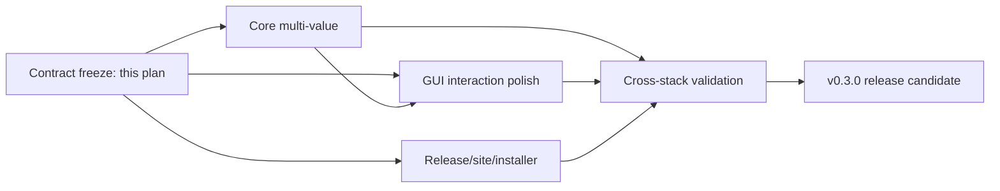

# Scrap v0.3.0 delivery architecture

- **Status:** implementation contract for the v0.3.0 milestone
- **Date:** 2026-09-20
- **Decision owner:** delivery lead; this document records the locked production direction
- **Scope:** multiple values per record, desktop micro-interactions, Windows shortcut behavior, product release page, versioning, CI, and GitHub Release
- **Out of scope:** Microsoft signing work, value search, per-value labels/types, synchronization, and a general credential schema

## 1. Problem definition and evidence

Scrap currently has a sound process boundary: GUI and CLI clients use local IPC, while `scrapd` alone owns validation, encryption, and SQLite. The requested change is not merely an editor enhancement. The scalar value assumption crosses the domain, protocol, daemon, CLI, GUI, and encrypted payload.

Repository inspection produced these material observations:

1. `Record`, the protocol DTOs, the CLI, and the GUI all model exactly one string.
2. SQLite schema v1 stores one opaque ciphertext per record, and the schema version participates in the authenticated additional data (AAD). A casual schema bump would make existing ciphertext fail authentication.
3. Exact and regular-expression matching already filter correctly in the domain. The GUI leaves prior candidates visible while a new request is pending, which makes unrelated rows appear to belong to the new mode.
4. Create-record focus restoration occurs while `IsBusy` still disables the workspace; no focus transition runs after the workspace is re-enabled.
5. Escape and several global shortcuts exist, but modal acceptance is incomplete.
6. Preview values use a 15 px monospaced stack; the editor inherits the proportional application font. The password glyph can therefore use different metrics from revealed text and the caret.
7. The MSI owns a Start Menu shortcut but not a per-user Desktop shortcut.

### Decision purpose

Deliver ordered multiple values without rewriting existing databases, losing old scalar data, or allowing mixed daemon/client versions to truncate a list. Fix the interaction defects at their state-machine and styling boundaries rather than adding control-local exceptions.

## 2. Preserved invariants

```text
GUI / CLI
    |
    | local length-prefixed JSON IPC
    v
scrapd ----> domain validation
    |  \
    |   +--> key-only search metadata
    v
AEAD ----> SQLite schema v1
```

The following remain hard invariants:

- external record identity is the ordinal, case-sensitive pair `(scope, key)`;
- a record is the atomic read/write/concurrency unit and has one monotonic revision;
- values are ordered, duplicates are meaningful, and every value is UTF-8 text;
- every record has at least one value; an individual value may be empty;
- presentation remains one record-level `Masked | Plain` policy in v0.3.0;
- values never enter list/search projections, indexes, logs, error text, or the product site;
- rename and set remain daemon-owned atomic operations; clients do not emulate them;
- SQLite schema version, encrypted-payload format, crypto-envelope version, protocol version, and product SemVer are separate concepts;
- existing singleton CLI byte behavior remains stable;
- `Scrap.slnx` is not part of this milestone unless a new project becomes unavoidable.

## 3. Canonical record model

### 3.1 Domain shape

```text
Record
  Scope           ScopeName
  Key             RecordKey
  Values          RecordValues       // immutable, ordered, non-empty
    [0..n)        RecordValue         // UTF-8 text, empty allowed
  Presentation    Masked | Plain      // applies to all values
  CreatedAt
  UpdatedAt
```

`RecordValues` is a dedicated immutable value object rather than a mutable `List<string>`:

| Property | Contract |
|---|---|
| Cardinality | `1..32` |
| Per-item size | at most 64 KiB UTF-8, preserving the current scalar limit |
| Aggregate size | at most 64 KiB of value UTF-8 bytes; codec overhead is checked separately |
| Ordering | stable and user-visible |
| Duplicates | preserved |
| Empty item | valid |
| Equality | ordered sequence equality |
| Mutation | complete immutable replacement |

The 64 KiB aggregate cap keeps the worst JSON escaping case comfortably below the existing 1 MiB IPC frame after DTO overhead and preserves the previous maximum for a singleton. Both the domain boundary and protocol boundary enforce the same constants; tests prove the maximum wire representation fits the frame.

There is deliberately no durable value ID in v0.3.0. The GUI may give each editor row an ephemeral draft ID for focus and collection updates, but order is the only persisted item identity. Adding stable IDs before independent value mutation exists would introduce identity, deletion, merge, and migration semantics without a user need.

### 3.2 Revision and presentation semantics

- Any full-list replacement or legacy first-item update increments the record revision once.
- Reordering is a record mutation and increments the same revision.
- Optimistic concurrency checks the record revision, not individual positions.
- `Presentation` applies to the whole list. Reveal state is transient UI state and is never persisted.
- Per-item masking or labels are explicit future features, not undocumented fields hidden in the first implementation.

## 4. Encrypted aggregate payload

### 4.1 Locked production design

Keep SQLite schema v1, its `records.value_ciphertext`, `nonce`, `crypto_version`, and the current AAD shape. Encode multiple values inside the single plaintext passed to the existing authenticated-encryption boundary.

The payload codec sits above `IRecordEncryptor`; the crypto module continues to encrypt and decrypt opaque bytes and does not learn list semantics.

```text
Legacy scalar payload (read compatibility only)
  strict UTF-8 bytes of Values[0]

v0.3 ordered-list payload (including singleton writes)
  invalid-UTF8 magic and codec version
  item count
  repeated (byte length, strict UTF-8 bytes)
```

The canonical binary layout is:

```text
FF 53 52 56 01              # invalid UTF-8 lead byte, "SRV", codec v1
count: uint8                 # 1..32
repeat count times:
  length: int32 little-endian
  value: length bytes of strict UTF-8
```

The first byte `0xFF` cannot occur in valid UTF-8. Existing values were validated and encoded as strict UTF-8, so the marker cannot collide with a legitimate legacy scalar, including text that looks like JSON or looks like the ASCII portion of the marker. The remaining magic and version reject accidental or future format confusion. Golden-vector tests lock the byte layout.

Decode rules are deterministic:

1. exact marker present: parse the bounded list; reject unsupported version, invalid count/length, trailing bytes, invalid UTF-8, or limit overflow as a safe corrupt-payload error;
2. marker absent and bytes are strict UTF-8: return a singleton list;
3. marker absent and bytes are not strict UTF-8: report corrupt payload; never guess another format.

Every successful v0.3 whole-list write uses the list codec, including a singleton. Existing rows remain untouched and decode as singleton lists until edited; there is no eager rewrite. This gives one write format and eliminates a singleton special case in current code.

### 4.2 Storage and transaction behavior

No SQL migration runs:

- `SqliteStore.CurrentSchemaVersion` remains `1`;
- the `meta.schema_version` value remains `1`;
- `RecordEncryptionContext.SchemaVersion` and the AAD encoding remain unchanged;
- `crypto_version` continues to mean the AEAD envelope version and is not overloaded as a list-format flag;
- startup performs the existing schema validation only.

Set keeps the existing prepare/encrypt/CAS-commit shape. The daemon validates and encodes the complete value list, encrypts it outside the write transaction, then commits one ciphertext under the existing short IMMEDIATE transaction and revision precondition. A crash or conflict therefore commits either the old complete list or the new complete list, never a prefix.

Rename should re-encrypt the decrypted payload bytes directly under the new scope/key AAD rather than decode and re-encode the list. This preserves the exact payload representation and removes a format-specific branch from both record rename and scope rename.

### 4.3 Aggregate versus normalized child rows

| Criterion | Chosen: one AEAD aggregate | Alternative: `record_values` child table |
|---|---|---|
| Existing DB | No SQL rewrite; old scalar decrypts as one item | Requires schema-v1 table rebuild or additional table and migration |
| AAD compatibility | Schema/AAD stays unchanged | Per-value identity needs a new context version or legacy decoding path |
| Atomic replace | Already the normal single-row operation | Requires a parent revision plus multi-row transactional replacement |
| Rename | Re-encrypt one opaque payload | Re-encrypt every child because scope/key are in AAD |
| Independent item update | Rewrites the small aggregate | Can update one child independently |
| Per-item metadata/nonce/ID | Not supported | Natural fit |
| Failure isolation | One malformed aggregate affects the record | One malformed child may leave other children readable |
| Complexity and migration risk | Low | Materially higher |

The aggregate is the production choice because v0.3 only requires a small ordered list, whole-record editing, one presentation policy, and one revision. It turns the new case into the existing normal case. With at most 32 items and 64 KiB aggregate text, rewriting one ciphertext is bounded and operationally insignificant compared with the migration and compatibility cost of child rows.

The normalized design remains a valid future direction if real requirements appear for independent item writes, stable per-item IDs, per-item policies, or materially larger records. Those are explicit migration triggers; benchmark aesthetics alone are not.

## 5. Protocol compatibility

### 5.1 Dual-version range

The v0.3 client uses protocol version 2. The v0.3 daemon accepts and advertises the inclusive range `1..2`. Responses echo the request's protocol version rather than always emitting the latest version.

An old client sends `daemon.version` as v1, receives the `1..2` range, and continues with v1. The standard v0.3 client requests v2. If a lingering v1-only daemon rejects negotiation, the client uses the existing daemon-control path to request its graceful shutdown, launches the packaged v0.3 daemon, reconnects, and only then permits the original operation. It never retries a mutation across that handoff because negotiation occurs before business requests.

This asymmetry is intentional:

```text
old v1 client  -> new v0.3 daemon: supported through safe first-item projection
new v2 client  -> old v1 daemon: rejected before any write
```

It prevents a new client from sending a list that an old daemon would silently interpret as one value, while avoiding an ecosystem-breaking refusal of old clients after the daemon upgrades.

### 5.2 Additive wire shape and v1 semantics

Keep legacy `value` as the first-item projection and add `values` as the complete ordered list. The exact DTO implementation may share types, but dispatch semantics depend on the negotiated request version.

| Operation | Protocol v1 | Protocol v2 |
|---|---|---|
| `record.get` | returns legacy `value = Values[0]`; additive `values` may be present and is ignored by old clients | consumes the complete `values`; `value` remains the first-item compatibility projection |
| create via `record.set` | scalar `value` creates a singleton | non-empty `values` creates the complete list |
| update via `record.set` | replaces index 0 and preserves any tail items | atomically replaces the complete list |
| list/search/rename/delete | unchanged | unchanged |

For v1 update, preserving the tail is the critical destructive-compatibility rule. Treating the old scalar setter as whole-record replacement would erase values the old client cannot see. A v1 create still creates one item. All paths retain the existing record revision precondition.

In a v2 whole-list request, `values` is non-empty and legacy `value` must be `null`. Supplying both is invalid parameters, never precedence-by-accident. Missing/`null`/empty collections are normalized and rejected at one protocol boundary. System.Text.Json should continue ignoring unknown response fields so old clients tolerate additive `values`.

### 5.3 Known limitations

- An old v1 client can read/copy only the first item. It must not be represented as a full multi-value editor.
- A record rewritten by v0.3 cannot be read by a downgraded old daemon, even when it currently has one item; the invalid-UTF8 marker makes the old strict decoder fail explicitly instead of misinterpreting data. Untouched legacy scalar rows remain readable.
- Protocol range and request-version echo need framing/dispatcher tests; `daemon.version` cannot use a v2-only first request because an old daemon must be able to answer the baseline probe.

## 6. CLI contract

The CLI remains optimized for deterministic scripts.

1. `scrap set <scope> <key>` continues to read one value from stdin. Through the v2 client it creates a singleton or performs an explicit first-item update that preserves the tail, matching the safe v1 rule.
2. `scrap get <scope> <key>` continues to write the first value exactly, with no added newline. Existing pipelines remain byte-compatible.
3. Add an explicit structured stdin mode for whole-list replacement, for example `--values-json-stdin`, accepting a JSON array of strings. Secrets never become argv values.
4. Add explicit retrieval modes: `--index <zero-based-index>` for raw one-item bytes and `--values-json` for a reversible full list. Do not join items with newlines because an item may itself contain newlines.
5. `--clipboard` must require a single selected item; full-list clipboard serialization is not an implicit behavior.
6. JSON errors and diagnostics never echo values or the full input payload.

Zero-based indexing matches JSON arrays and scripting conventions. Out-of-range indices are stable usage/data errors, not empty output.

## 7. Desktop interaction architecture

### 7.1 Editor and preview model

```text
RecordEditorState
  Scope / Key / ExpectedRevision
  Values: ObservableCollection<EditableValueRow>
    DraftId       ephemeral UI identity
    Text          secret string
  IsMasked       persisted record policy
  ValuesVisible  transient editor state
```

- A new editor starts with exactly one value row.
- Add appends; remove is disabled when only one row remains; reorder preserves draft rows and focus.
- Save snapshots the collection into immutable domain order before the async call.
- Detail preview renders one reusable value row with an individual Copy action. Reveal/remask may apply to the whole record because presentation is record-level, but the label must say so.
- No control logs, formats into exceptions, or places values into automation names.

### 7.2 Keyboard and focus matrix

| Context | Gesture | Behavior |
|---|---|---|
| Anywhere outside text editing | `Ctrl+K` or `/` | focus and select search |
| Workspace | `Ctrl+N` | open new-record editor for the selected management scope |
| Search | `Enter` | select/open the first current result |
| Search | `Down` | move focus to the first result |
| Any modal | `Escape` | cancel/close without mutation |
| Scope editor | `Enter` | save when valid |
| Delete confirmation | `Enter` on the focused confirmation button | confirm |
| Record key or non-multiline control | `Enter` | save when valid |
| Multiline value editor | bare `Enter` | insert a newline |
| Record editor | `Ctrl+Enter` | save when valid |
| Revealed detail without a modal | `Escape` | remask |

Disabled commands do not swallow the key. Modal focus is trapped, initial focus is deterministic, and closing returns focus to the invoker except after a successful create, where the next logical target is search/current result. This follows the W3C modal-dialog keyboard and focus guidance while preserving multiline text semantics.

The post-create sequence becomes one explicit state transition:

```text
save -> refresh search/count -> close busy state -> enable workspace
     -> restore focus -> optionally select new record only if it belongs in current results
```

Do not post a focus request while `IsBusy` still disables the target. Scope refresh updates selection through one invariant-preserving setter/helper so `HasSelectedScope`, command states, and bindings cannot diverge.

### 7.3 Search boundary

Search still targets keys only.

| Mode | Visible-result rule |
|---|---|
| Exact | only equality matches |
| Regex | only `Regex.IsMatch` matches; an empty query returns no rows so blank Regex never becomes an accidental browse mode |
| Fuzzy | ranked eligible candidates may include low/zero-score records up to the limit |

On any query, mode, case, or scope-filter revision, clear the visible candidate collection immediately and retain the existing revision/cancellation guard. This makes the displayed collection always belong to the latest completed request. Fuzzy remains the only mode whose completed results intentionally contain weakly related records; exact and regex cannot display stale rows while waiting.

Search availability is derived from searchable scopes, not from the independently selected management scope. After create, the query/mode/case/scope filter remains unchanged. If the new key does not match an exact/regex query, it is not injected as a special result; a success toast is sufficient.

### 7.4 Layout and typography

- Move **New Record** out of the search-candidate header and into the management-scope action group beside the scope selector. Its destination is then visually explicit.
- The candidate empty state may keep a secondary create affordance, but it calls the same command and names the destination scope.
- Define one semantic `ValueFontFamily`, `ValueFontSize` (15 px), and value line-height/padding resource from the current preview style: `IBM Plex Mono, Cascadia Mono, Consolas, monospace`.
- Apply that resource to editor text, revealed preview, masked preview, and value-row text. Use a mask glyph with metrics verified in the same resolved font stack; do not compensate by inserting spaces into the data.
- Give the value editor sufficient inner trailing padding and verify the caret after the final ASCII, CJK, emoji, and mask glyph at 100%, 125%, and 150% scale. The fix belongs in the shared value-text style, not mode-specific margins.

Avalonia documents `PasswordChar`, `RevealPassword`, `AcceptsReturn`, and text wrapping as independent TextBox properties. The design keeps those mechanisms but makes typography and input semantics common.

## 8. Windows installer

Add a per-user `DesktopFolder` shortcut to `scrap-gui.exe` while retaining the Start Menu shortcut, PATH registration, and Add/Remove Programs entry.

- The Desktop shortcut has its own stable WiX component/key path.
- Because the MSI is per-user, Windows Installer resolves `DesktopFolder` to the installing user's desktop, including OS-managed redirection.
- Upgrade repairs/retains one shortcut; uninstall removes only the shortcut owned by the MSI.
- User data under `~/.scrap` remains outside installer ownership.
- Extend the real MSI smoke test to assert create, target/icon, upgrade, and uninstall cleanup for both shortcuts.
- Microsoft signing remains explicitly out of scope; preserve existing optional signing behavior without making it a v0.3 gate.

## 9. Version, Actions, release, and product page

### 9.1 Version sources

- Set the product `VersionPrefix`/informational version to `0.3.0` in the central MSBuild properties.
- Release tag is exactly `v0.3.0`; the release metadata job compares the tag with the checked-in product version before building.
- MSI product/file metadata and archive names continue to derive from the validated tag.
- Store four-part numeric version remains an independent monotonically increasing counter; do not reset it to `0.3.0.0` if that would be a downgrade.
- The website package's npm version is tooling metadata unless it is deliberately made the product-version source. Tests should compare the displayed product version with the authoritative `0.3.0` value instead of maintaining silent duplicates.

### 9.2 GitHub Actions topology

The repository already has CI, Pages, Store, and tag-release workflows. Evolve rather than replace them:

```text
push / pull request
  |- 3 OS: locked restore -> Release build -> all .NET tests
  |- website: frozen install -> check -> tests -> static build
  `- Windows: WiX build and shortcut-table inspection

tag v0.3.0
  |- validate tag == product version
  |- repeat 3-OS tests, including legacy/mixed protocol fixtures
  |- publish and smoke four RIDs
  |- Windows MSI actual install/upgrade/uninstall shortcut smoke
  |- verify checksums and asset inventory
  `- assemble draft -> attach all assets -> publish GitHub Release
```

Keep actions pinned to reviewed commit SHAs, locked dependency restoration, least job permissions, bounded timeouts, and concurrency rules. Do not use `--clobber` as the normal publication design if immutable releases are enabled. GitHub recommends draft creation, attaching all assets, and only then publishing an immutable release. Artifact attestations are production-ready and useful provenance, but optional for this feature milestone; checksums and reproducible workflow evidence remain mandatory.

### 9.3 Product release page

Update `website/` as a user-facing release surface, not as implementation documentation:

- headline/outcome: one record can keep several related short values together;
- v0.3.0 release highlights: multiple values, dependable Enter/Escape workflows, accurate exact/regex results, consistent secret typography, and a Windows Desktop shortcut;
- real localized screenshots after the final GUI is built;
- plain claims: local-first and encrypted at rest, not “unhackable” or “secure clipboard”;
- download CTA and asset names aligned with the actual `v0.3.0` Release;
- update zh-CN and English together and add content tests that reject stale version/copy.

Do not paste protocol, codec, database, or migration details into the product page. Technical rationale stays in repository docs; the page tells users what improves their work.

## 10. Verification matrix

| Area | Required evidence |
|---|---|
| Domain | non-empty/order/duplicate/empty-item/count/per-item/aggregate boundaries; immutable replacement |
| Codec | legacy scalar fixtures; golden multi vectors; marker non-collision; malformed/truncated/trailing/invalid-UTF8 rejection; boundary allocations |
| Crypto/storage | byte-identical legacy read; no schema change; set atomicity; conflict rollback; record/scope rename re-encrypt raw payload; DB/WAL plaintext scan |
| Protocol | v1 baseline negotiation; daemon range `1..2`; response echoes request version; v2->old daemon rejection before mutation; unknown additive field tolerance |
| Compatibility | old v1 client -> new daemon get first/set first preserving tail; new client -> old daemon refuses; singleton raw stdout unchanged |
| CLI | singleton stdin/get bytes, indexed raw get, JSON list round-trip including newlines/empty/Unicode, no secret in argv/errors |
| Search | blocked-response UI test proves immediate clear; exact/regex return only matches; fuzzy remains ranked broad discovery; values absent from metadata |
| GUI | add/remove/reorder/save/copy; create-then-type search; keyboard focus matrix; shared typography/mask/caret visual checks |
| MSI | per-user Desktop and Start Menu shortcut install, upgrade, target/icon, uninstall cleanup; data sentinel preserved |
| Release/site | tag/version mismatch fails; three-OS tests; RID smoke; checksum inventory; both locale pages and real screenshots |

Compatibility fixtures must be produced by the v0.2 implementation or checked-in as opaque test assets. Creating all fixtures with current code does not prove upgrade behavior.

## 11. Dependency-aware work graph and file ownership

Each slice has a single writer for its file region. No repository-wide write lock is needed.



| Slice | Exclusive production ownership | Deliverable / dependency |
|---|---|---|
| **A. Core multi-value** | `src/Scrap.Domain/**`, payload codec location, `src/Scrap.Protocol/**`, `src/Scrap.Client/**`, `src/Scrap.Storage.Sqlite/**`, `src/Scrap.Daemon/SqliteDaemonOperations.cs`, associated Domain/Protocol/Storage/Daemon/Integration tests | Domain list, codec, dual protocol, v1 projection, daemon replacement, raw-payload rename. Publishes final DTO/client API before GUI adapter integration. |
| **B. GUI interaction polish** | `src/Scrap.Gui/**`, `tests/Scrap.Gui.Tests/**` | Multi-row editor/preview plus search, focus, keyboard, button placement, and typography fixes. May compile against a small agreed adapter shim until A lands; does not edit core contracts. |
| **C. Release/site/installer** | `Directory.Build.props`, `.github/workflows/**`, `installer/Scrap.Installer.Windows/**`, `website/**`, website tests, release/store copy as assigned | Version `0.3.0`, Actions gates, Desktop shortcut, user-facing bilingual release page. Does not edit application core or GUI. |
| **Validation** | test fixtures and cross-project tests only; production fixes return to A/B/C owner | Mixed-version matrix, old payload fixture, packaged MSI and RID smoke, final acceptance evidence. |
| **Docs** | `docs/v0.3-delivery-plan.md` and later authoritative design/release-doc updates | Reconcile `scrap-design.md`, `ux-product-spec.md`, and `release.md` only after behavior is implemented; never use docs to mask a failed test. |

Integration order is A protocol/domain/codec -> A daemon/client -> B adapter/view model/view -> C packaging/site -> compatibility and packaged-product validation. Commits should be cohesive by slice; do not mix generated screenshots or site copy into core protocol commits.

## 12. Rejected alternatives and material risks

| Alternative/risk | Judgment |
|---|---|
| Store JSON in the old plaintext | Rejected. Guessing JSON would collide with legitimate scalar secrets; binary invalid-UTF8 magic is unambiguous. |
| Bump SQLite schema/AAD to 2 | Rejected for v0.3. It creates an unnecessary eager migration and can make all old ciphertext undecryptable. |
| Normalized child rows now | Deferred. Strong future model for independent item semantics, but disproportionate today. |
| Protocol v2 only, reject all v1 clients | Rejected. Dual range safely supports old-client -> new-daemon without allowing new-client -> old-daemon truncation. |
| Let v1 scalar set replace the full list | Rejected as destructive; it would erase an invisible tail. |
| Join CLI values with newline/NUL | Rejected; text values may contain either and scripts need reversible output. |
| Bare Enter saves from every control | Rejected; it breaks multiline secret entry. |
| Keep stale exact/regex candidates with a spinner | Rejected; the list would claim semantics it does not currently satisfy. |
| Per-value presentation/labels | Deferred until requested; they materially change domain, storage, and UI semantics. |

The largest residual compatibility risk is downgrade after a record has been rewritten by v0.3. The marker guarantees explicit failure rather than silent corruption, but v0.2 cannot understand that payload. Release notes must state that the database remains physically schema v1 while v0.3-written record payloads require v0.3 or later.

## 13. Industry practice versus research frontier

### Production-ready guidance adopted

- W3C's modal pattern specifies trapped tab focus, Escape to close, deterministic initial focus, and focus return; these directly support the keyboard/focus matrix.
- Avalonia's official TextBox contract treats masking, reveal, multiline input, and wrapping as separate properties; Scrap should unify style resources without conflating those behaviors.
- SQLite's official generalized migration procedure favors transactional rebuild and `foreign_key_check`. Because the aggregate design needs no relational change, the lower-risk action is not to migrate at all.
- Microsoft documents `DesktopFolder` as the current user's Desktop for a per-user install, matching Scrap's MSI scope.
- GitHub recommends draft-assemble-publish for immutable releases and documents artifact provenance attestations. The existing pinned, least-privilege workflows are the correct base.

### Frontier evidence, useful but not release-blocking

- CCS 2024 research on password masking found modest usability differences between masked and unmasked entry and variability across devices. It supports an available, clear reveal control, but does not determine Scrap's font or masking policy.
- Recent SQL-equivalence work (SQLSolver, SPES, VeriEQL, and Graphiti) can prove or find counterexamples for modeled relational observations. It cannot validate DDL execution, AEAD code, rollback, or UI/protocol compatibility. Since v0.3 deliberately avoids a schema migration, adopting a solver would add research machinery without addressing the dominant risks.
- More elaborate per-value encrypted storage is academically and architecturally interesting, but production adoption should wait for independent-item operations or measured aggregate bottlenecks.

Conclusions above are provisional engineering judgments: compatibility fixtures, packaged-product tests, and real GUI visual/focus validation can revise them. Benchmark elegance alone cannot override observed user contracts.

## 14. References

### Official and industry sources

- [Avalonia TextBox](https://docs.avaloniaui.net/controls/input/text-input/textbox)
- [W3C WAI-ARIA modal dialog pattern](https://www.w3.org/WAI/ARIA/apg/patterns/dialog-modal/)
- [SQLite ALTER TABLE and generalized migration procedure](https://www.sqlite.org/lang_altertable.html)
- [SQLite transactions](https://www.sqlite.org/lang_transaction.html)
- [Microsoft.Data.Sqlite transactions](https://learn.microsoft.com/en-us/dotnet/standard/data/sqlite/transactions)
- [.NET `AesGcm.Encrypt`](https://learn.microsoft.com/en-us/dotnet/api/system.security.cryptography.aesgcm.encrypt)
- [NIST SP 800-38D: GCM and GMAC](https://csrc.nist.gov/pubs/sp/800/38/d/final)
- [System.Text.Json unmapped-member handling](https://learn.microsoft.com/en-us/dotnet/standard/serialization/system-text-json/missing-members)
- [Microsoft Windows Installer `DesktopFolder`](https://learn.microsoft.com/en-us/windows/win32/msi/desktopfolder)
- [GitHub immutable releases](https://docs.github.com/en/code-security/concepts/supply-chain-security/immutable-releases)
- [GitHub artifact attestations](https://docs.github.com/en/actions/how-tos/secure-your-work/use-artifact-attestations/use-artifact-attestations)

### Peer-reviewed research

- Hu et al., [Unmasking the Security and Usability of Password Masking, ACM CCS 2024](https://doi.org/10.1145/3658644.3690206)
- Ding et al., [Proving Query Equivalence Using Linear Integer Arithmetic, PACM Data/SIGMOD 2024](https://doi.org/10.1145/3626768)
- Zhou et al., [SPES: A Symbolic Approach to Proving Query Equivalence Under Bag Semantics, IEEE ICDE 2022](https://doi.org/10.1109/ICDE53745.2022.00250)
- He et al., [VeriEQL: Bounded Equivalence Verification for Complex SQL Queries with Integrity Constraints, OOPSLA 2024](https://doi.org/10.1145/3649849)
- He et al., [Graphiti: Bridging Graph and Relational Database Queries, PLDI 2025](https://doi.org/10.1145/3729319)
